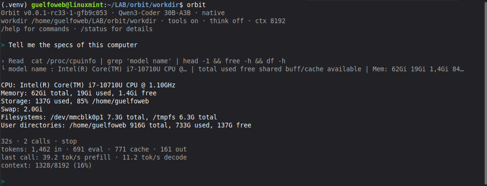

# Orbit

Orbit is a small Python-first local runtime for Gemma 4 26B-A4B, verified Qwen 3.6 35B-A3B, and verified Qwen3-Coder 30B-A3B profiles on CPU-only machines. The primary path is the native `orbit server` backend, using vendored llama.cpp/ggml libraries built and loaded by Orbit. It does not require an external `llama-server` process for normal use.

Orbit stays model-driven. The runtime enforces safety, size, timeout, context, and tool-contract boundaries, but the model decides whether to answer directly or use exposed tools.

Linux is the main target environment. macOS may work. Windows is not a target.

<p align="center">
  
</p>

## Supported Models

| Model | Prefill | Generation | Tools-on chat | Tool + final | Peak RAM |
|---|---:|---:|---:|---:|---:|
| [Gemma 4 26B-A4B](https://huggingface.co/ggml-org/gemma-4-26B-A4B-it-GGUF) | ~24.2 tok/s | ~7.1 tok/s | ~3.0 s | ~20.9 s | ~29.4 GiB |
| [Qwen 3.6 35B-A3B](https://huggingface.co/ggml-org/Qwen3.6-35B-A3B-GGUF) | ~31.8 tok/s | ~7.6 tok/s | ~6.1 s | ~23.8 s | ~36.4 GiB |
| [Qwen3-Coder 30B-A3B](https://huggingface.co/unsloth/Qwen3-Coder-30B-A3B-Instruct-GGUF) | ~26.0 tok/s | ~10.7 tok/s | ~3.0 s | ~18.4 s | ~31.3 GiB |
| [Ornith 1.5 35B-A3B](https://huggingface.co/ornith-ai/Ornith-1.5-35B-A3B-GGUF) | — | — | — | — | — |

NUC10 Intel Core i7-10710U (6 cores / 12 threads) with 64 GB RAM, no GPU
Linux, llama.cpp b9551, ctx=8192, 6 threads, batch/ubatch 256/128, Flash Attention AUTO, thinking off, and MTP off.

Ornith 1.5 35B-A3B is the verified profile the analysis workflow was qualified on. Its row is empty
because it has not been measured under the warm steady-state chat protocol used for the other rows.
Expect memory in the same range as the other 35B-A3B profile.

Chat and tool latencies are warm steady-state medians after one excluded warm-up. Prefill measures evaluated tokens only and excludes cache benefit. These are not universal performance claims; actual results vary with CPU, memory bandwidth, quantization, backend build, and workload.

`orbit server --low-memory` is an opt-in mode supported only for the verified Qwen3-Coder 30B-A3B profile. Default behavior is unchanged and CPU repacking remains enabled unless this flag is specified. On the documented NUC10, peak RSS was approximately 31.3 GiB by default and 18.3 GiB in low-memory mode, a 41.6% reduction, with weighted prefill approximately 13.9% slower and decode approximately 1% slower. 24 GB RAM is the recommended practical minimum for a complete host; 20 GiB was qualified only as a process-memory limit and is not a general host recommendation.

## Chat and Analysis

Orbit has two workflows. Chat is the default and is unchanged: you ask, the model
answers, and it may use the exposed tools.

Analysis is for inspecting one local artifact in an isolated workspace. Start it
explicitly, or let Orbit route to it when a request is clearly about analysing a
file:

```
/analysis path/to/artifact
/report            # answer from the evidence already collected, running nothing
/chat              # back to normal chat
```

An analysis step is deliberately narrow. The model writes a short Python program,
Orbit runs it in a sandbox with no network and a read-only copy of the artifact,
and the output is recorded in an evidence store with its provenance. One model
call performs at most one action, and control returns to you after each step, so
you steer by typing the next instruction — `continue` included.

Everything the model derives stays inside the session workspace. Full outputs
remain re-attestable in the evidence store; only bounded excerpts are shown to
the model.

### Autonomous continuation (opt-in)

By default an analysis advances one step at a time and waits for you. With

```bash
ORBIT_ANALYSIS_AUTONOMOUS=1 orbit
```

Orbit continues by itself while each step produces verifiably new evidence,
stopping when the model finishes, when progress stalls, or at a hard bound of 12
actions. Every ending except a cancellation produces one grounded report from the
evidence collected.

This mode is off by default. It is opt-in for cost rather than for
correctness: a step that measures something new counts as progress whether or
not the measurement was worth making, so an artifact with little to derive can
still attract many actions. Whether that trade is worthwhile is a judgement for
the operator. Ctrl-C stops a run immediately.

## Requirements

- Python 3.11 or newer
- Linux recommended
- CMake for building the vendored native libraries

## Install

```bash
git clone https://github.com/guelfoweb/orbit.git
cd orbit
sudo apt install cmake
python3 -m venv .venv
. .venv/bin/activate
pip install -e .
```

Build the vendored native libraries if they are not already present:

```bash
python3 scripts/build_native.py
```

Inspect the host and review the recommended server configuration:

```bash
scripts/suggest-server-profile.sh
```

## Limitations

- Linux x86_64 CPU-only is the qualified platform. macOS may work; Windows is not
  a target. There is no GPU path.
- Analysis runs one artifact per session, and the sandbox has no network.
- Autonomous continuation is opt-in and may perform unnecessary work on trivial
  artifacts (see above).
- Eager capture of the analysis prefix at startup is opt-in
  (`ORBIT_ORNITH_ANALYSIS_PREFIX_PREWARM=1`); by default the prefix is captured
  lazily by the first analysis step, which costs that step and benefits every
  later one.
- Analysis features are qualified on the verified Ornith 1.5 profile. Other
  verified profiles fall back to ordinary cold behaviour rather than failing.

## Quick Start

Start the native server and select an available verified model:

```bash
orbit server
```

The default context is 8192 tokens, equivalent to:

```bash
orbit server --ctx 8192
```

`--ctx` controls the server context window and the maximum input that can fit
in one model call. To use a larger context:

```bash
orbit server --ctx 19456
```

For Qwen3-Coder with low-memory mode and a larger context:

```bash
orbit server --ctx 19456 --low-memory
```

To select a model explicitly:

```bash
orbit server --model /path/to/model.gguf --ctx 19456
```

`/max-tokens` controls maximum response length only; it does not enlarge the
context. If a full document does not fit, Orbit reports the minimum required
context and suggests a suitable `--ctx`. Larger contexts require additional
memory, mainly for the KV cache.

In another terminal:

```bash
orbit
```

For a one-shot request:

```bash
orbit --workdir workdir --think off "hi, how are you?"
```
